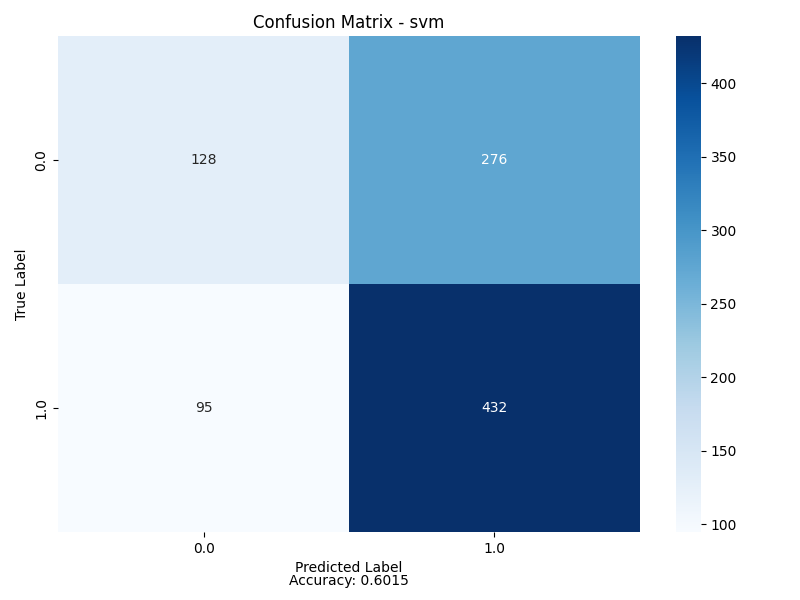
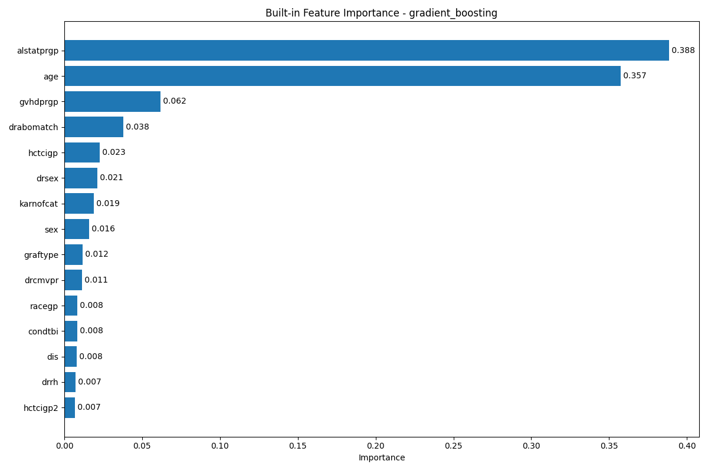
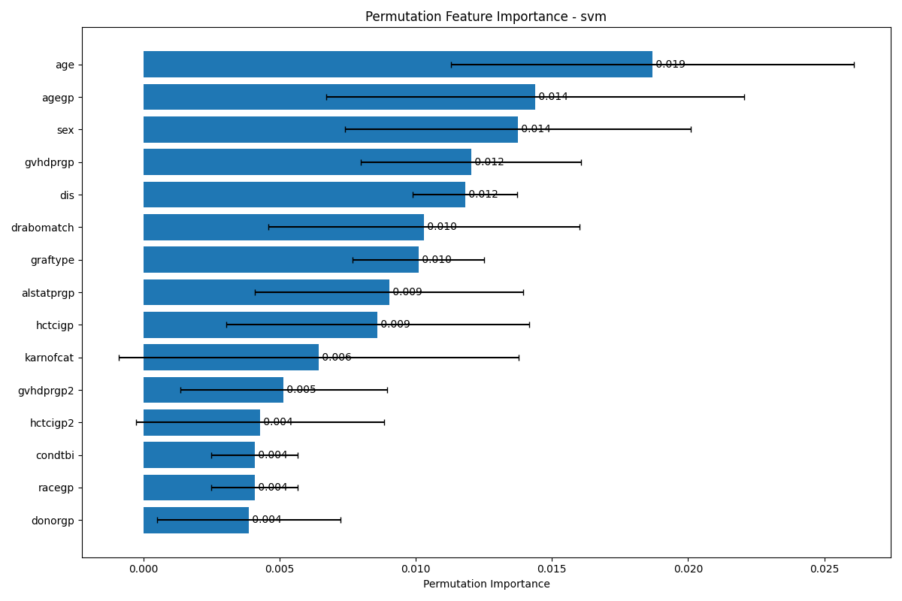
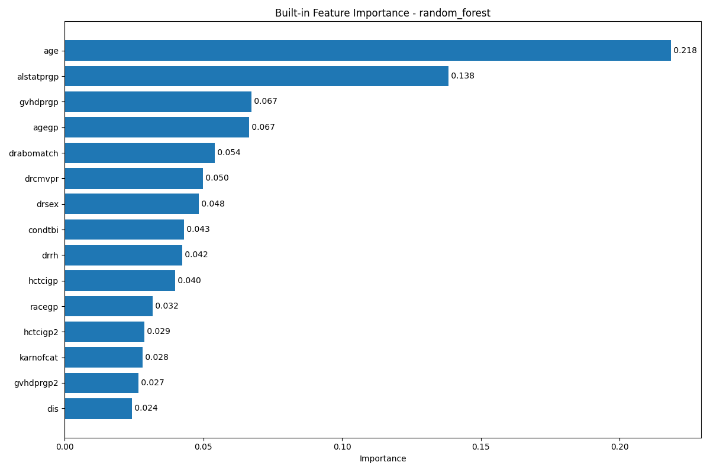

# Project Report: Predictive Modeling for Acute Leukemia (AML / ALL) Transplant Outcomes

## Overview
This project is an initial benchmark effort applying machine learning to outcomes of allogeneic hematopoietic cell transplantation (allo-HCT) in patients with acute leukemia. It uses the publicly available ds1302 dataset (~5,000 transplant cases), which enables reproducibility and accessibility for researchers.

#### Context
	- Leukemia (AML/ALL) is a blood cancer that disrupts production of normal blood cells
	- Stem cell transplant (allo-HCT) is one of the few potentially curative options, but carries high risks and 
 	uncertain outcomes

#### Motivation
	- Predicting survival after allo-HCT is difficult because it depends on multiple interacting factors (patient age, 
 	remission status, donor compatibility, and prophylaxis regimens)
	- Machine learning can identify which features most strongly influence survival and, in the longer term, guide donor 
 	selection and treatment decisions

#### Current Stage (this work)
	- Built baseline classification models predicting overall survival (OS) as a binary endpoint (death vs censored)
	- Benchmarked eight classifiers with feature importance analyses
	- Documented challenges in applying ML to clinical tabular data: structured missingness, censoring, 
 	redundancy/collinearity, and modest discrimination

#### Long-Term Goal
	- Expand from binary classification to time-to-event survival and competing-risks modeling
	- Use richer features (e.g., immunological and genomic markers)
	- Ultimately “flip the task”: recommend the optimal donor for a given patient using the outcome as features, 
 	creating a decision-support system for individualized transplant planning

## Data Processing
- **Initial Dataset**: 4946 rows, 49 features
- **Cleaned Dataset**: 4653 rows, 20 features
- **Target Variable**: `dead`
- **Key Features**: `age`, `sex`, `drabomatch`, `alstatprgp`, `gvhdprgp`
- **Dropped Features (irrelevant / outcome based / missing values)**: `pseudoid`,`pseudoccn`, `yeartx`, `anc`, `dwoancrel`, `intxanc`, `plt`, `dwoplt`, `intxplt`, `agvhd24`, `dwoagvhd24`, `agvhd34`, `dwoagvhd34`, `intxagvhd34`, `intxagvhd24`, `cgvhd`, `dwocgvhd`, `intxcgvhd`, `dfs`, `trm`, `rel`, `intxrel`, `intxsurv`, `pgf`, `dnrage_urd`, `dagegp`, `rbcreduc13`, `buffycp13`, `rbcreduc4`, `buffycp4`, `plasmarmv`

## Model Performance
Eight classification models were trained and evaluated using accuracy, precision, recall, F1-score, and AUC. Hyperparameter tuning was performed using GridSearchCV.

### Model Comparison
| Model                | Accuracy | Precision | Recall | F1-Score | AUC   |
|----------------------|----------|-----------|--------|----------|-------|
| SVM                 | 0.6015   | 0.5945    | 0.6015 | 0.5732   | N/A   |
| Naive Bayes         | 0.5951   | 0.5954    | 0.5951 | 0.5952   | 0.6106|
| Random Forest       | 0.5908   | 0.5827    | 0.5908 | 0.5807   | 0.6118|
| Gradient Boosting   | 0.5854   | 0.5745    | 0.5854 | 0.5450   | 0.5998|
| Logistic Regression | 0.5671   | 0.5578    | 0.5671 | 0.5575   | 0.5603|
| Neural Network      | 0.5628   | 0.5670    | 0.5628 | 0.5643   | 0.5882|
| Decision Tree       | 0.5521   | 0.5535    | 0.5521 | 0.5527   | 0.5549|
| KNN                 | 0.5306   | 0.5313    | 0.5306 | 0.5309   | 0.5364|

### Best Model
- **Model**: SVM
- **Accuracy**: 0.6015
- **Precision**: 0.5945
- **Recall**: 0.6015
- **F1-Score**: 0.5732

## Feature Importance Analysis
### Logistic Regression
Top features based on coefficients:
1. `age` (0.3267)
2. `alstatprgp` (0.2466)
3. `gvhdprgp` (0.1844)
4. `condtbi` (-0.1394)
5. `hctcigp` (0.1384)

### Random Forest
Top features based on built-in importance:
1. `age` (21.8%)
2. `alstatprgp` (13.8%)
3. `gvhdprgp` (6.7%)
4. `agegp` (6.6%)
5. `drabomatch` (5.4%)

### Gradient Boosting
Top features based on built-in importance:
1. `alstatprgp` (38.8%)
2. `age` (35.7%)
3. `gvhdprgp` (6.1%)
4. `drabomatch` (3.8%)
5. `hctcigp` (2.3%)

### SVM
Top features based on permutation importance:
1. `age` (1.87%)
2. `agegp` (1.44%)
3. `sex` (1.37%)
4. `gvhdprgp` (1.20%)
5. `dis` (1.18%)

## Data Dictionary Integration & Variable Definitions

Special / patterned missing or administrative codes encountered:
- 99 / 99.x / -9 / -9.x family (context-specific meanings: Missing, Not Applicable, Different form version, Not available, Inconclusive, etc.)
- These were hard-excluded (row deletion) in the current pipeline (see Limitations for bias considerations).

Identifiers (excluded from modeling):\
1. pseudoid – Pseudo Recipient ID (identifier)\
2. pseudoccn – Pseudo Center (identifier)

Main Effect:\
3. drabomatch – Donor–recipient ABO match:\
   Codes: 0 Matched; 1 Minor mismatch; 2 Major mismatch; 3 Bi-directional

Recipient Variables:\
4. age – Recipient age (continuous, years)\
5. agegp – Recipient age group: 1 18–29; 2 30–39; 3 40–49; 4 50–59; 5 60–69; 6 70+\
6. sex – Recipient sex: 1 Male; 2 Female\
7. racegp – Recipient race: 1 White; 2 Black/African American; 3 Asian; 4 Native Hawaiian / Other Pacific Islander; 5 American Indian / Alaska Native; 6 >1 race; 99 Missing\
8. hctcigp – HCT-CI group: 0 Score 0; 1 Score 1; 2 Score 2; 3 3+; 99 Missing\
9. hctcigp2 – Collapsed HCT-CI: 0 Score 0; 1 Scores 1–2; 2 Score 3+; 99 Missing\
10. karnofcat – Karnofsky/Lansky performance: 1 90–100; 2 <90; 99 Missing

Disease Variables:\
11. dis – Primary disease: 1 AML; 2 ALL\
12. alstatprgp – Disease status at HCT: 1 PIF; 2 CR1; 3 CR2; 4 ≥CR3; 5 Relapse; 99 Missing

Transplant Variables:\
13. condtbi – Conditioning intensity & TBI: 1 MAC TBI; 2 MAC non-TBI; 3 RIC/NMA; 99 Missing\
14. gvhdprgp – GVHD prophylaxis (detailed): 0 Post Cy; 1 TAC+MTX±; 2 TAC+MMF±; 3 TAC±; 4 CSA+MMF±; 5 CSA+MTX±; 6 Others\
15. gvhdprgp2 – GVHD prophylaxis (grouped): 1 TAC ± others; 2 CSA ± others; 3 PTCy ± others; 4 Other(s); 99 Missing\
16. atgcampathgp2 – ATG / alemtuzumab use: 1 ATG or Campath; 2 No ATG/Campath; 99 Missing\
17. graftype – Graft type: 1 Bone marrow; 2 Peripheral blood\
18. donorgp – Donor type: 1 HLA-identical sibling; 2 Well-matched unrelated (8/8)\
19. dnrage_urd – Donor age (continuous; unrelated donors only; NA for siblings)\
20. dagegp – Donor age group (unrelated only): -9 NA (sibling); 1 18–29; 2 30–39; 3 40–49; 4 50–59; 5 60–69; 99 Missing\
21. drrh – Donor–recipient Rh factor: 0 +/+; 1 +/-; 2 -/+; 3 -/-; 99 Missing\
22. drcmvpr – Donor–recipient CMV serostatus: 0 +/+; 1 +/-; 2 -/+; 3 -/-; 99.1 Missing donor; 99.2 Missing recipient; 99.3 Recipient not tested/inconclusive\
23. drsex – Donor–recipient sex pairing: 1 M–M; 2 M–F; 3 F–M; 4 F–F

Graft Manipulation (era / form version dependent):\
24. rbcreduc13 – RBC depletion (form 2006 v1–3): -9.2 NA different version; -9.1 NA data not available; 0 No; 1 Yes\
25. buffycp13 – Buffy coat preparation (form 2006 v1–3): -9.3 NA (only complete if RBC depletion Yes); -9.2 NA different version; -9.1 NA data not available; 0 No; 1 Yes\
26. rbcreduc4 – RBC depletion (form 2006 v4): -9.2 NA different version; -9.1 NA data not available; 0 No; 1 Yes\
27. buffycp4 – Buffy coat preparation (form 2006 v4): -9.2 NA; -9.1 NA data not available; 0 No; 1 Yes\
28. plasmarmv – Volume/plasma reduction: -9.1 NA data not available; 0 No; 1 Yes\
29. yeartx – Year of transplant (continuous)

Outcome / Time-to-Event Variables (not modeled yet unless specified):\
30. anc – ANC recovery: 0 Censoring; 1 Event; 99 Missing\
31. dwoancrel – Death w/o ANC or relapse within 28d pre-ANC: 0 Censoring; 1 Event; 99 Missing\
32. intxanc – Time to neutrophil engraftment (months)\
33. plt – Platelet recovery: 0 Censoring; 1 Event; 99 Missing\
34. dwoplt – Death without platelet recovery: 0 Censoring; 1 Event; 99 Missing\
35. intxplt – Time to platelet recovery (months)\
36. agvhd24 – Acute GVHD grade II–IV (computed): 0 Censoring; 1 Event; 99 Missing\
37. dwoagvhd24 – Death without grade II–IV aGVHD: 0 Censoring; 1 Event; 99 Missing\
38. intxagvhd24 – Time to grade II–IV aGVHD or censor (months)\
39. agvhd34 – Acute GVHD grade III–IV: 0 Censoring; 1 Event; 99 Missing\
40. dwoagvhd34 – Death without grade III–IV aGVHD: 0 Censoring; 1 Event; 99 Missing\
41. intxagvhd34 – Time to grade III–IV aGVHD or censor (months)\
42. cgvhd – Chronic GVHD: 0 Censoring; 1 Event; 99 Missing\
43. dwocgvhd – Death without chronic GVHD: 0 Censoring; 1 Event; 99 Missing\
44. intxcgvhd – Time to chronic GVHD or censor (months)\
45. dfs – Disease-free survival: 0 Censoring; 1 Event; 99 Missing\
46. trm – Non-relapse mortality: 0 Censoring; 1 Event; 99 Missing\
47. rel – Relapse: 0 Censoring; 1 Event; 99 Missing\
48. intxrel – Time to relapse / death (months)\
49. dead – Overall survival event indicator: 0 Censoring; 1 Death (MODELED ENDPOINT)\
50. intxsurv – Time to last follow-up (months)\
51. pgf – Primary graft failure (ANC recovery by day 28): 0 Censoring; 1 Event; 99 Missing

Modeling Status Annotations:
- Excluded identifiers: pseudoid, pseudoccn.
- Outcome variables (30–51) currently unused except `dead`; these support future survival / competing risks modeling.
- Graft manipulation variables (24–28) and donor age constructs (19–20) excluded due to missingness / restricted applicability but are candidates for engineered feature inclusion.

## Clinical Impact Statement
This modeling effort, though currently modest in discriminative performance, highlights reproducible early mortality determinants in allogeneic transplantation: chronological age, disease satus at transplant, and prophylactic immunomodulation strategy. The strong gradient boosting emphasis on active disease (alstatprgp) underscores the persistent adverse biology of uncontrolled leukemia at HCT, reinforcing prioritization of achieving deep remission pre-transplant when feasible.

The intermediate yet consistent influence of GVHD prophylaxis patterns suggests potential trade-offs between immune reconstitution and toxicity profiles that warrant stratified outcome analyses (e.g., infection-mediated vs. GVHD-mediated mortality). The recurring (if moderate) ABO match signal suggests residual transfusion or hemolytic complexity effects remain clinically relevant in select subgroups.

For clinicians and investigators, these findings argue for:
- Intensified pre-HCT disease control strategies in high-risk (PIF / relapse) candidates.
- Systematic evaluation of prophylaxis regimens beyond GVHD incidence—integrating survival, infection burden, and immune recovery metrics.
- Prospective collection of richer biologic and immunologic markers (e.g., MRD, donor-specific antibodies, cytokine kinetics) to elevate prognostic precision beyond demographic and categorical regimen data.

Ultimately, integrating survival modeling, enhanced feature engineering, and calibrated individualized risk outputs can evolve this framework into a clinically actionable decision-support system guiding conditioning selection, prophylaxis tailoring, and resource triage.

## Expanded Feature Importance Interpretation (Clinical Lens)
Cross-model convergence provides higher confidence in clinically meaningful signals:

1. Age (continuous & grouped): Strong across virtually all models. Both `age` and `agegp` appearing in importance (Random Forest, SVM permutation) suggests non-linear risk acceleration with advancing age groups beyond simple linear trends.
2. Disease Status at HCT (alstatprgp): High gradient boosting weight (≈39%) and strong random forest contribution underscores that disease progression at time of transplant elevates early mortality risk.
3. GVHD Prophylaxis Regimens (gvhdprgp / gvhdprgp2): Moderate, model-dependent signals imply prophylaxis strategy correlates with outcome—potentially reflecting both regimen biology and confounding by indication (e.g., Post-Cy often in haplo or mismatched settings not explicitly encoded here).
4. ABO Matching (drabomatch): Recurrent mid-level importance indicates that even in modern practice, ABO compatibility may still modestly impact early survival or serve as a surrogate for transfusion complexity.
5. Performance Status (karnofcat) & Comorbidity (hctcigp): Present but not dominant—may reflect limited variance in performance distribution (majority high) or overlapping risk mediation through age and disease status.
6. CMV Pairing (drcmvpr) & Rh Factor (drrh): Appear sporadically; weak to modest signals could surface more strongly in time-to-event or infection-specific endpoints rather than binary all-cause early mortality.
7. Graft Source (graftype) & Donor Type (donorgp): Lesser relative importance here; potential confounding by prophylaxis regimen choices or patient selection not fully disentangled.

## Novel Insights Derived from Cross-Model Synthesis
- Dual Representation of Age (continuous + grouped) ranking in SVM and tree ensembles implies risk is not strictly linear—supporting exploration of spline-based or piecewise hazard models.
- Disproportionate weighting of `alstatprgp` in boosting vs. more distributed importance in forests suggests boosting is capturing sharper interaction boundaries between disease status and other variables (e.g., `age`, `condtbi`).
- Moderate but persistent signal from donor-recipient ABO matching, despite its reduced emphasis in contemporary practice, invites targeted analysis of transfusion burden or hemolytic complications as mediators.
- GVHD prophylaxis pattern importance may partly reflect underlying graft source or donor relation not strongly weighted, hinting at latent interaction structures (e.g., Post-Cy + peripheral blood vs. traditional calcineurin inhibitor backbones).

## Encoding & Modeling Notes
- All predictors are numeric-coded categorical or continuous and were used directly without explicit one-hot expansion in the current pipeline (implicit ordinal treatment). Some variables (e.g., `gvhdprgp`, `gvhdprgp2`, `alstatprgp`, `racegp`) are nominal and could benefit from one-hot encoding to avoid imposing artificial ordinality.
- Certain related variables (e.g., age & agegp; hctcigp & hctcigp2; gvhdprgp & gvhdprgp2) introduce collinearity/redundancy that can dilute individual feature signals in linear models.
- Removal (instead of imputation) of rows containing patterned missingness codes (99 / 99.x / -9.x) may introduce selection bias if missingness is not random (e.g., center practices or era effects).
- Time-to-event variables enable richer survival analysis (recommended next phase).

## Visual Assets
Representative confusion matrices and feature importance plots for each model are stored under `visuals/classification/<model_name>/` (e.g., random_forest, gradient_boosting, svm). These provide qualitative confirmation of moderate class separation and concentrated feature attribution.

## Limitations
- Modeling Endpoint: Treated `dead` as a simple binary endpoint; ignores censoring structure inherent in transplant outcomes (time-to-event survival modeling would be more appropriate—Cox PH, Fine-Gray for competing risks, random survival forests).
- Discrimination: AUC values (~0.56–0.61) indicate only modest discriminative power; current variable set insufficient for robust individualized mortality prediction.
- Class Imbalance: Moderate imbalance (≈60% event) not explicitly addressed via weighting or resampling—could bias threshold-dependent metrics.
- Missingness Handling: Row-wise deletion of structured missingness codes can bias cohort composition (e.g., exclusion of centers/patients with incomplete prophylaxis or serostatus documentation). Multiple imputation or explicit missingness indicators would retain statistical power and reduce bias.
- Categorical Encoding: Treating nominal categories as ordinal (e.g., `gvhdprgp`) may distort distance-based model geometry and linear coefficient interpretation.
- Collinearity: Paired encodings (age & agegp, hctcigp & hctcigp2, gvhdprgp & gvhdprgp2) inflate redundancy and may dilute individual feature interpretability.
- Calibration Not Assessed: Probability calibration (Brier score, reliability curves) not yet evaluated—important for clinical decision support deployment.

## Recommendations & Future Directions
1. Transition to Survival Analysis: Model overall survival and non-relapse mortality using Cox, Fine-Gray, or machine learning survival methods (e.g., gradient boosting survival, DeepSurv) to leverage time-to-event granularity.
2. Advanced Feature Engineering:
   - Interaction terms: Age × Disease status, Prophylaxis × Donor type, Conditioning × Disease status.
   - Non-linear transforms: Restricted cubic splines for age and comorbidity burden.
   - Collapse or one-hot encode nominal therapy variables to remove artificial ordinality.
3. Missing Data Strategy: Replace listwise deletion with multiple imputation (MICE) or add explicit missingness indicators for serostatus/prophylaxis fields.
4. Class Imbalance Mitigation: Incorporate class_weight='balanced', focal loss (in neural nets), or resampling (SMOTE variants) if shifting to rarer endpoints (e.g., TRM, relapse separately).
5. Model Calibration: Assess and apply Platt scaling / isotonic regression for clinically interpretable probabilities.
6. External Validation: Apply model to an independent temporal or institutional cohort to evaluate generalizability.
7. Explainability Enhancements: Add SHAP value analysis to quantify individualized risk drivers and contrast with global feature rankings.
8. Composite Risk Score: Derive a simplified, clinically interpretable score (e.g., weighted sum of top 5 predictors) and compare performance vs. ML models.
9. Endpoint Expansion: Separate composite mortality into cause-specific (relapse vs. non-relapse) and incorporate competing risks structure.
10. Data Augmentation: Integrate laboratory kinetics, donor-specific HLA mismatch metrics, infection markers, or early post-transplant complications as dynamic covariates.
11. Detailed Classification: The dataset includes additional outcome metrics, rather than simple survival rate, that could provide more insights
12. Flip Predictions: use outcome variables for prediction of "ideal" donor or recipient

## Reproducibility Notes
- Hyperparameter tuning via GridSearchCV with 5-fold cross-validation.
- Standard scaling applied to features when enabled (distance and margin-based models benefit most).
- Random seed: 42 for reproducibility.
- Current pipeline performs hard row exclusion for coded missingness; modify in `models.py::prepare_data` to implement alternative strategies.

## Next Steps (Action Checklist)
- [ ] Predict additional outcome variables for more detailed insights (time, type of death, etc...)
- [ ] Implement one-hot encoding for nominal categorical variables.
- [ ] Get rid of redundant / correlated features
- [ ] Introduce multiple imputation for structured missing codes.
- [ ] Add survival analysis module (Cox / RSF / Gradient Boosted Survival Trees).
- [ ] Evaluate SHAP for local/global explainability.
- [ ] Calibrate predicted probabilities (reliability curves, Brier score).
- [ ] Build cause-specific competing risks models (TRM vs. relapse mortality).
- [ ] External temporal validation split (e.g., stratify by `yeartx` if available).
- [ ] Try different input features to predict different outputs
- [ ] Try non-traditional ML methods, such as reinforcement learning
